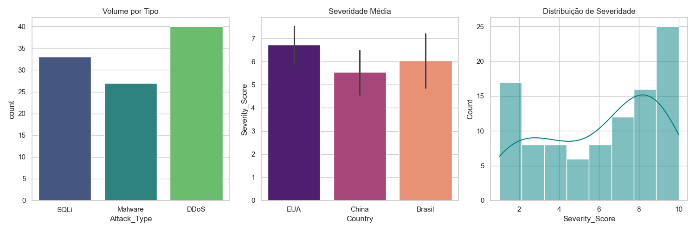

# Projeto 5: Análise de Inteligência de Ameaças - Semana 03

## 🎯 Objetivo
Analisar um dataset de ataques cibernéticos para identificar padrões de severidade por país e volume por tipo de protocolo.

## 🛠️ Ferramentas Utilizadas
- **Python 3.12**
- **Pandas**: Limpeza e estruturação dos dados.
- **Seaborn/Matplotlib**: Visualização avançada (Dashboard).

## 📊 Insights Obtidos
- Identificação dos países com maior média de severidade em incidentes.
- Distribuição volumétrica dos tipos de ataques (DDoS, SQLi, etc).

## 📂 Estrutura do Projeto
- `cyber_attacks_simulated.csv`: Dados brutos da análise.
- `analise_avancada_cyber.py`: Script de processamento.
- `graficos/`: Dashboards gerados em PNG.

### 🖼️ Resultado da Análise
