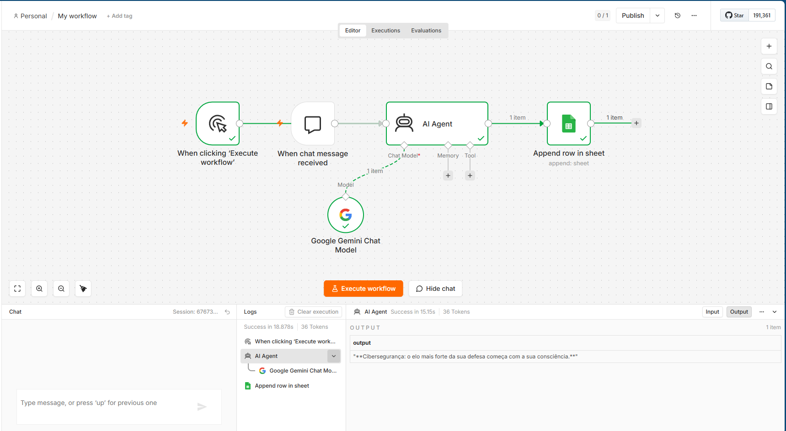
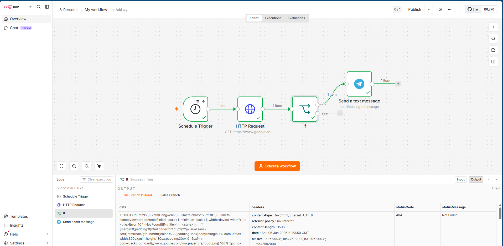
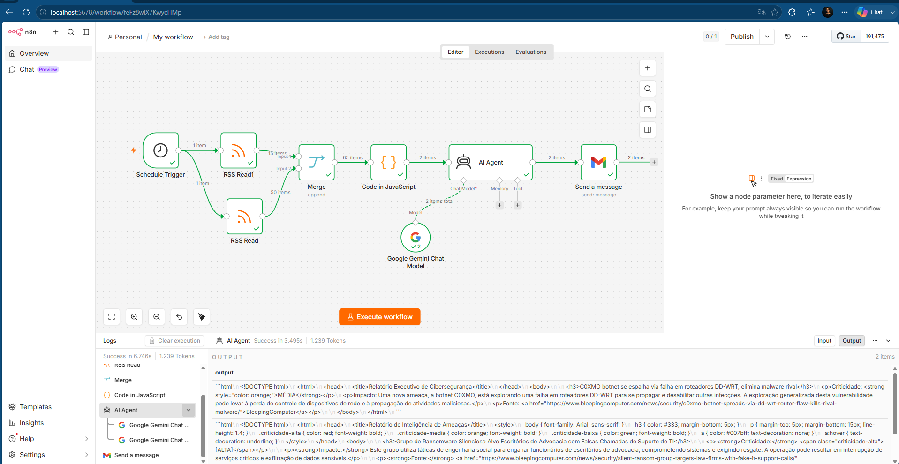
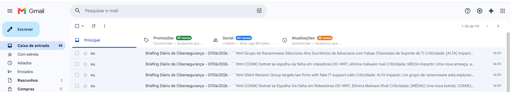
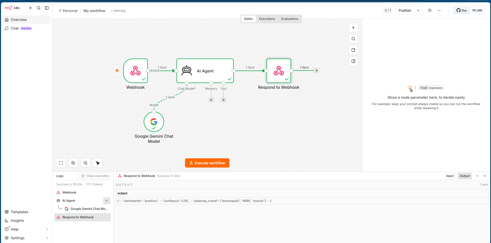
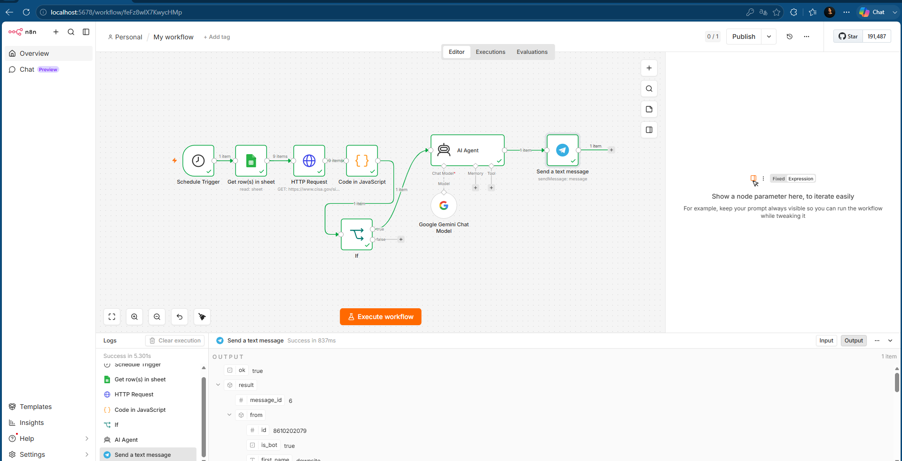
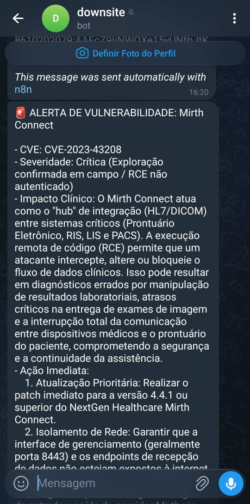

# Semana 05: Automação Visual com n8n

Nesta semana, transicionamos do código manual para a orquestração visual de automações. O foco foi utilizar o **n8n** para conectar ferramentas, APIs e IA de forma visual, criando agentes que executam tarefas repetitivas e garantem a segurança de forma autônoma.

## 📂 Estrutura da Pasta (`/semana-05`)
* **Workflows (.json)**: 01 a 05.
* **`/prints`**: Diretório com os fluxos e suas respectivas evidências de execução.

---

## 🧩 Conceitos Fundamentais
A automação no n8n é construída sobre quatro pilares:
* **Workflow:** A sequência de ações (o fluxo completo).
* **Node:** Cada unidade de processamento (ex: `HTTP Request`, `OpenAI`).
* **Trigger:** O evento de ignição (ex: `Schedule`, `Webhook`).
* **Connection:** O canal de transporte de dados entre os nodes.

---

## 🛠️ Detalhamento dos Projetos

### 01. Primeiro Workflow: Automação Básica
* **Função:** Demonstrar o ciclo de vida: `Manual Trigger` -> `OpenAI` -> `Google Sheets`.
* 

### 02. Notificador de Site (Uptime)
* **Função:** Checagem periódica e alerta em caso de indisponibilidade.
* **Workflow:** 
* **Evidência (Telegram):** 

### 03. Threat Intel Diário
* **Função:** Leitura de feeds RSS, filtragem, resumo via LLM e disparo por e-mail.
* **Workflow:** 
* **Evidência (E-mail):** 

### 04. API Pessoal (Webhook)
* **Função:** Endpoint (`POST`) para análise de sentimentos via IA com retorno em `JSON`.
* 

### 05. Projeto Extra: Monitor CISA - Inteligência de Ameaças em Tempo Real
Este projeto foi **concebido e desenvolvido por mim** como uma solução de segurança proativa, unindo automação, inteligência de dados e gestão de vulnerabilidades. A ideia central foi transformar um processo de triagem manual e lento em um sistema inteligente que "conversa" com o inventário da empresa.

* **A Ideia:** O desafio era resolver o *gap* de tempo entre a publicação de uma vulnerabilidade explorada (pela CISA) e a ciência sobre se essa falha atinge ou não os nossos ativos.
* **Por que criei:** Para evitar o "ruído" excessivo de alertas genéricos. Eu precisava de um sistema que não apenas me avisasse sobre uma falha, mas que me dissesse: *"Isso coloca em risco um sistema que nós usamos"*.
* **O Diferencial Técnico:** * **Cruzamento de Inventário:** Diferente de um monitoramento simples, este workflow faz uma leitura dinâmica da minha planilha de ativos (Google Sheets).
    * **Filtro de Relevância:** A automação cruza o feed da CISA com o inventário, disparando o alerta (via Telegram) **apenas se houver correspondência**. 
* **Valor Operacional:** Este sistema automatiza a etapa de triagem inicial, otimizando tempo e garantindo que o alerta crítico chegue apenas quando existe risco real à operação.

**Evidências de Funcionamento:**
* **Fluxo no n8n:** 
* **Relatório no Telegram:** 

---

## 🔐 Boas Práticas e Segurança
* **Tratamento de Erros:** Uso do node `Error Trigger` para alertas de falha.
* **Segurança:** Uso de variáveis de ambiente para tokens e credenciais.
* **Testes:** Fluxos validados manualmente antes da automação (agendamento).

---
*Kensei Cyber AI Academy 2026 | Foco: Eficiência operacional através de automações inteligentes*